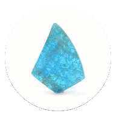

# apatite
|QML streams WebGL calls to the client browser, integrating with C-C++ libuv multiuser code, while Flutter-Dart places a simple mobile-device frame around this web app|
|:---:|
|[dwn.herokuapp.com](http://dwn.herokuapp.com)|
||
